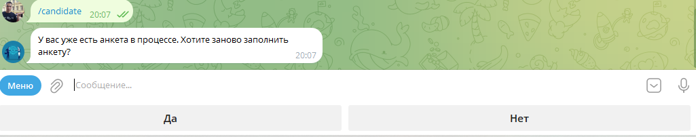
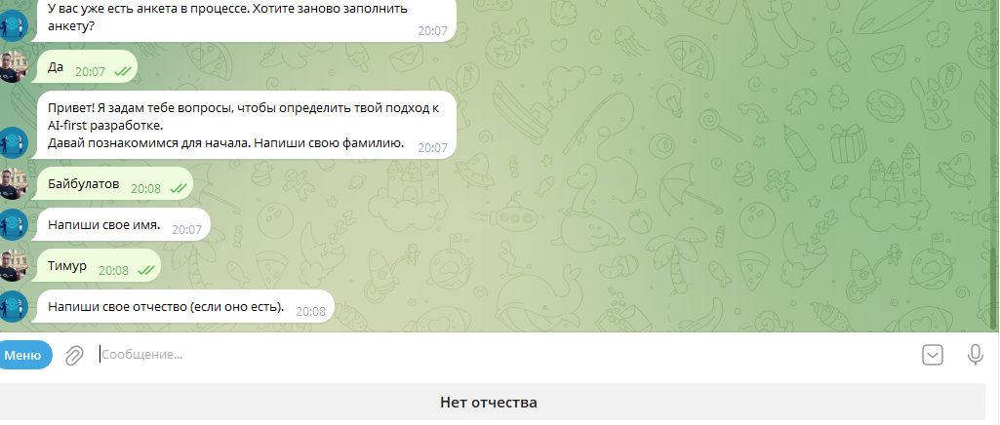
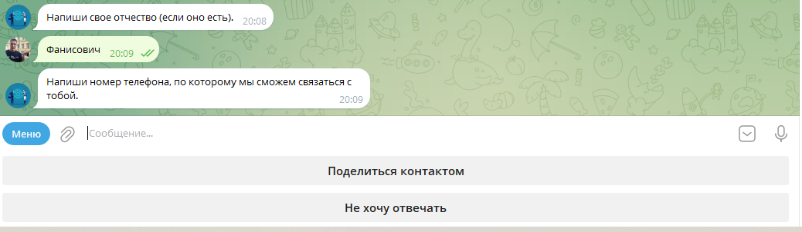
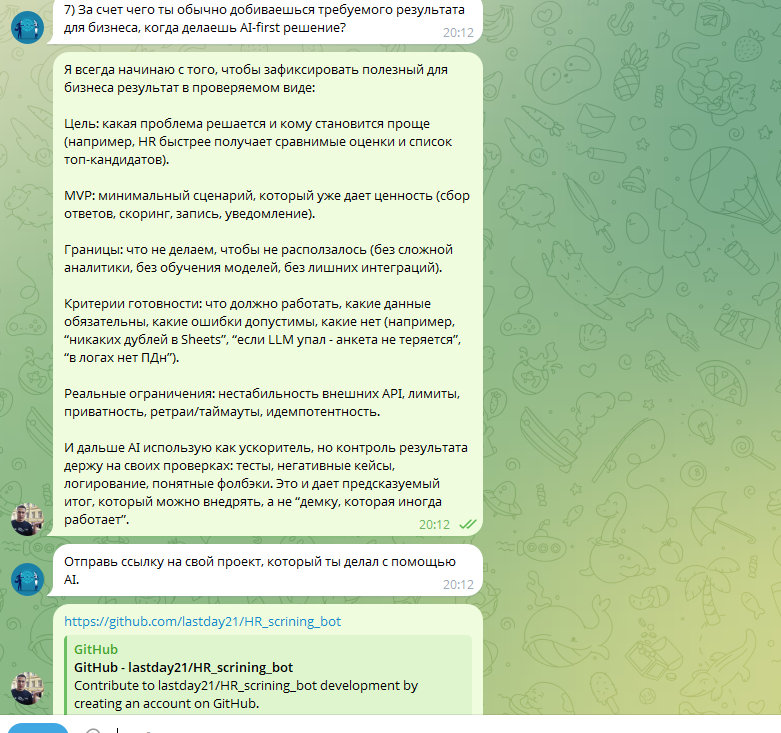
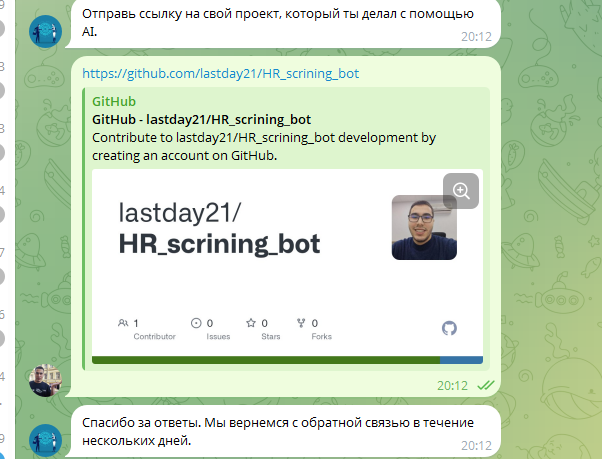
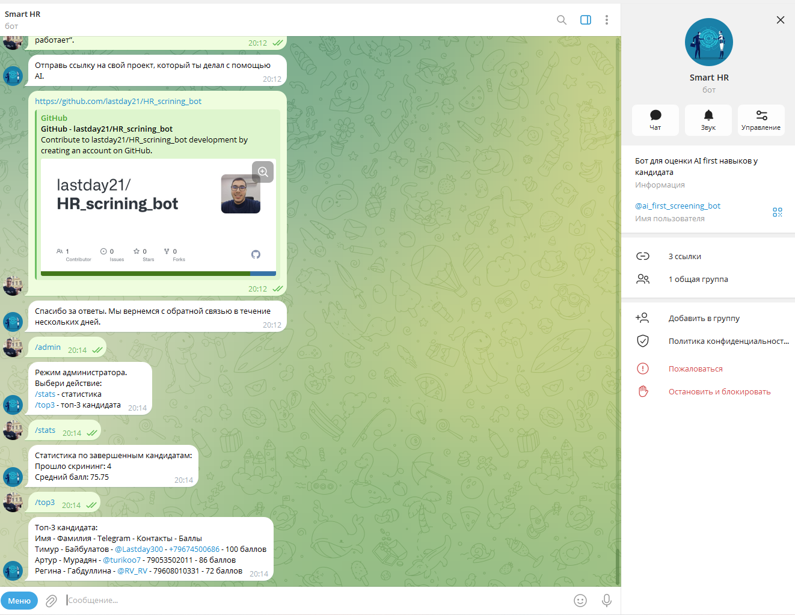
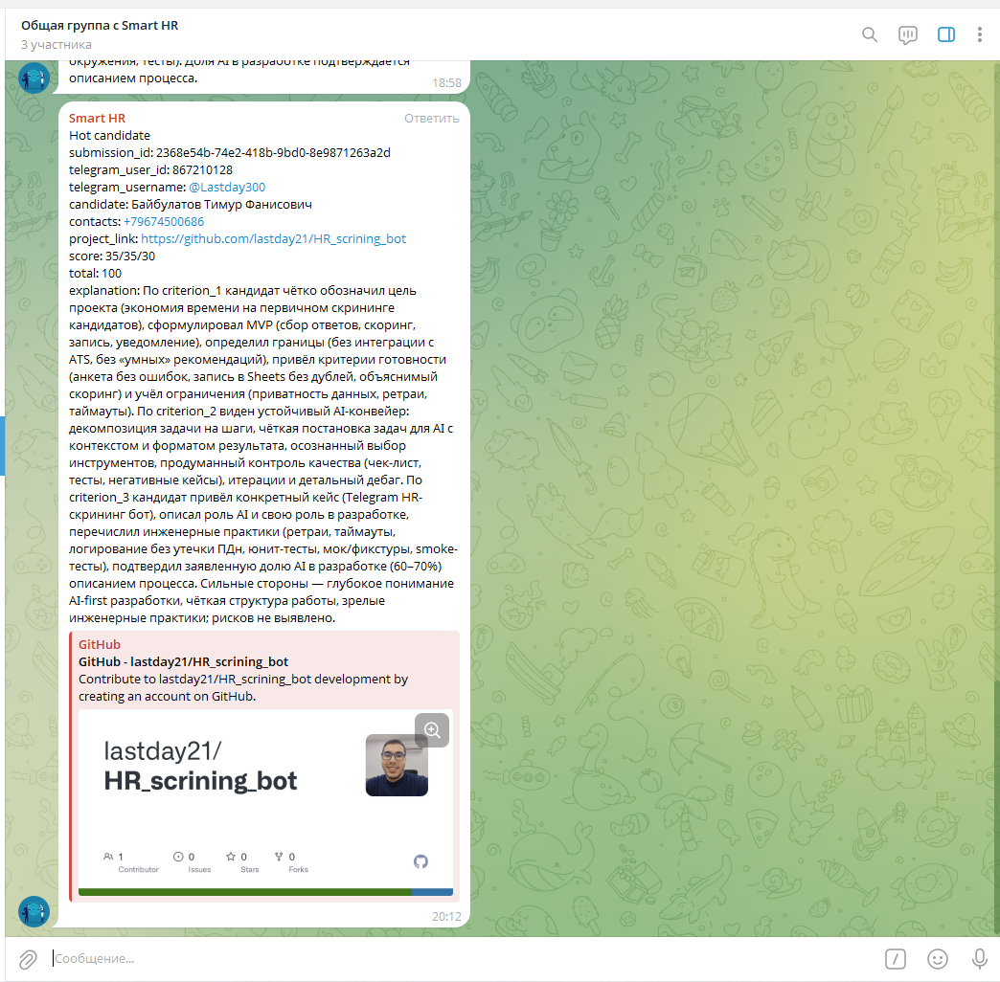
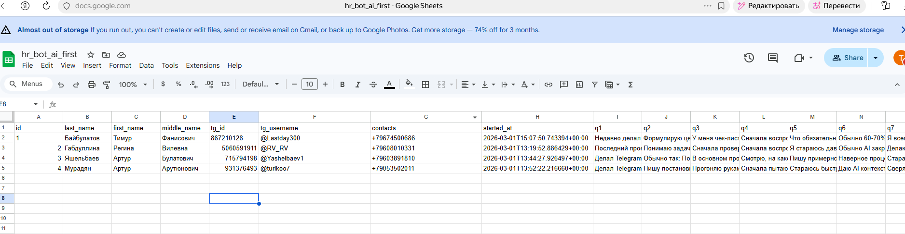

# ScreenCast

Здесь показан функционал бота.
Сразу как кандидат нажимает `/start`, начинается заполнение анкеты.
В моем случае я являюсь администратором, поэтому у меня после старта доступны два режима: `/candidate` и `/admin`.

## 1. Предложение заново заполнить анкету

## 2. Старт анкеты и ввод фамилии, имени и отчества

Я решил разделить ФИО, чтобы они хранились в разных ячейках. Это пригодится, если в дальнейшем понадобится делать рассылку или отдельно работать с полями кандидата.
Также здесь есть валидация, чтобы кандидат не вводил явный мусор.

## 3. Шаг сбора контактов кандидата

Далее запрашиваются контакты для связи с кандидатом. Также автоматически берется ник в Telegram, но он есть не у всех, поэтому основным контактом сделан именно телефон.
Номер тоже проходит валидацию.

## 4. Прохождение вопросов и переход к ссылке на проект

Далее идет опрос кандидата по вопросам. Ответы ожидаются развернутые, есть валидация на слишком короткие ответы меньше 10 символов.

## 5. Предпросмотр ссылки на GitHub и финальное сообщение кандидату

После вопросов бот просит ссылку на проект. У кандидата также есть возможность ничего не отправлять.
Здесь тоже есть валидация ссылки.

## 6. Режим администратора со статистикой и топ-3 кандидатов

Есть отдельный режим администратора. Его доступность определяется через `ADMIN_USER_ID` в окружении.
В этом режиме доступны базовые команды для просмотра статистики по кандидатам и топ-3 кандидатов с контактной информацией.

## 7. Уведомление о hot candidate в общей группе

Кандидаты, которые набирают 70 и более баллов, помечаются как hot candidate.
В общую группу отправляется информация о кандидате, его контактах, проекте и краткое summary от ИИ.

## 8. Google Sheets с сохраненными результатами кандидатов

В Google Sheets сохраняется полная информация по кандидатам, которые завершили прохождение анкеты.
Таблица содержит ФИО, Telegram id и username, контакты, время старта, ответы на вопросы и итоговую оценку.

